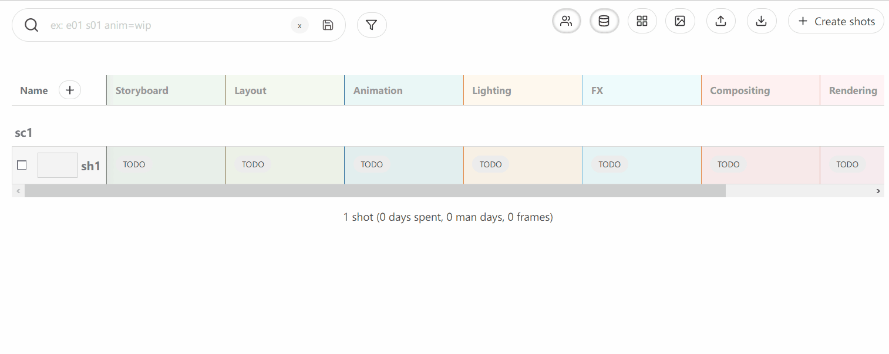
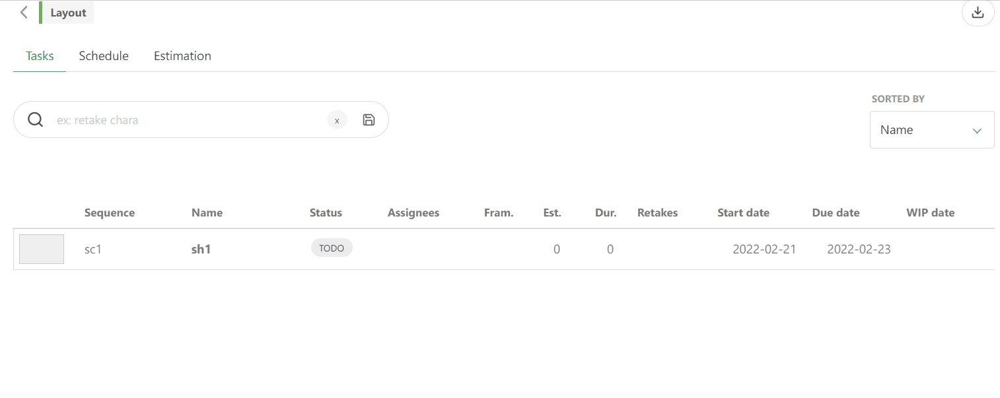
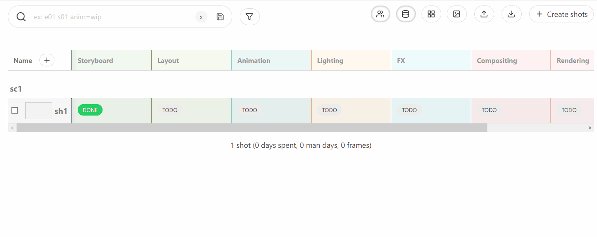

# Kitsu Essentials - personal events collection for CG-Wire Kitsu

**Kitsu Essentials** is a small set of events I wrote to simplify workflow in animation studio I'm currently working.
**Requirements:**
- Kistu instanse with login and password of *Studio Manager*

## Events
### rtw - Ready for Work
This event sets next task in pipeline to status **Ready to Work** if the current task is marked as **Done**.

**Requirements:** a new status **Ready to Work** with short name **rtw** should be created

**Demo:**

### delta - Commenting Plan/Actual task duration
Whenever you close task with **Done** status there will be a comment published noting if the task was completed ahead of plannig or delayed.

**Requirements:** task(s) must have `start date` and `end date` set.

**Demo:**

*In this demonstation the task was closed (via DONE) the next day of plan deadline*

### lock - Prevent skipping tasks
It disallow jumping over tasks in **TODO** status.

**Demo:**
